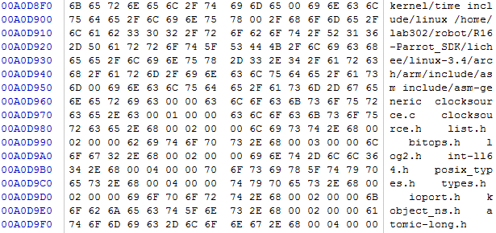
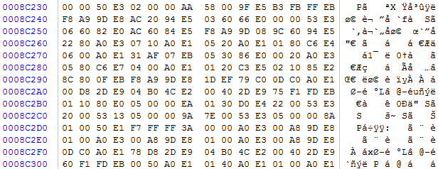

# 合成内核镜像

2017-01-11

----------------------

经过编译的linux内核产生了很多镜像版本，这里对他们进行了下分析：

## 内核镜像的主要组件

| 组件名称          | 描述
| :--------------   | :------------
| vmlinx            | ELF格式的内核主体，包含符号、注释、调试信息（编译时加-g选项）和与架构相关的部分
| System.map        | 基于文本的内核符号表，针对vmlinux模块
| .tmp_System.map   | 生成这个文件只是为了对System.map进行完好性检查；否则不会用于最后的构建镜像中
| Image             | 二进制内核模块，去除了符号、标记和注释
| head.o            | 与ARM相关的启动代码，对所有的ARM处理器通用。引导加载程序会将控制权交给这个对象
| piggy.gz          | 经过gzip压缩的Image文件
| piggy.o           | 将文件piggy.gz进行汇编后生成的对象，这样它就可以和下一个对象misc.o链接在一起了
| misc.o            | 其中包含了用于解压内核镜像piggy.gz的函数，另外，我们在一些架构上常会看到的引导消息”Uncompressing Linux ...Done“也是由它产生的
| head-xscale.o     | 专门针对XScale处理器初始化
| big-endian.o      | 这是个汇编语言编写的小程序，用于将XScale处理器转换到大端字节序模式
| vmlinux           | 合成内核镜像。和第一个vmlinux不一样，这个二进制镜像是由内核主体和表格中的对象链接生成的
| zImage            | 最终的合成内核镜像，由引导加载程序加载

## 合成内核镜像

            objcopy                      gzip              asm
    vmlinux -------> Image二进制目标文件 ------> piggy.gz -----> piggy.o
    内核主体        去除符号、标记、注释       压缩的二
                        的二进制镜像           进制内核

    cat Image | gzip -f -9 > piggy.gz

    ___________________________________________________________________
    |     piggy.o    | misc.o | big_endian.o | head-xscale.o | head.o |
    ￣￣￣￣￣￣￣￣￣￣￣￣￣￣￣￣￣￣￣￣￣￣￣￣￣￣￣￣￣￣￣￣￣￣￣￣￣￣
    | 二进制内核镜像 |              启动加载程序                         |
                        可启动的内核镜像

### vmlinux镜像部分图

可以看到这里包含了很多可识别的符号，需要处理才能运行在真实的硬件上

### Image镜像部分图

这里已经没有了可识别的字符了，纯粹的二进制代码

